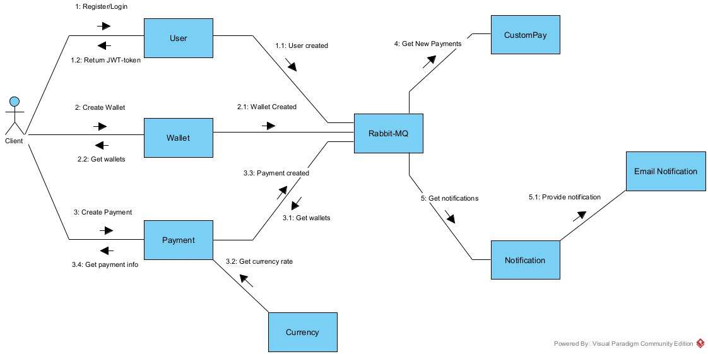

## Финансовая система

1. **Тип приложения**
    Клиент-серверное WEB приложение.
2. **Стратегия развертывания**
    Разработка приложения ведется с использованием системы контроля версий gitlab.
    Для приложения настроена система тестировани, билдования и деплоя на сервер, которая работает автоматически при наличии изменений в ветке. 
    При коммите каких либо изменений, запускается процесс развертывания.
3. **Выбор технологий**
    Для клиент-серверного приложения выбран классический трехуровневый стек
    - RabbitMQ и SQL-Server
    - C#
    - React+TS
    Взаимодействие клиента и сервера осуществляется посредством API.
4. **Показатели качества**
    - Быстродействие
    - Удобство UI/UX
    - Сложность развертывания и поддержки
5. **Структурная схема**
