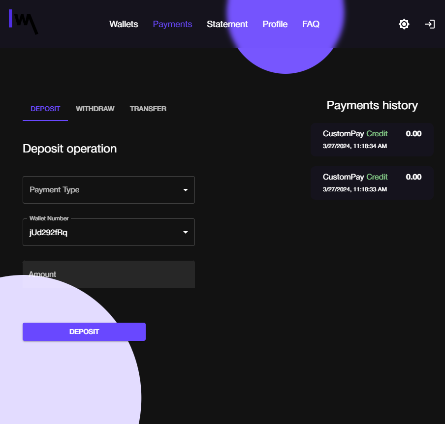
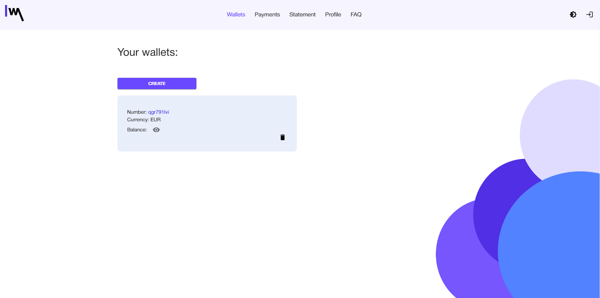

## Отчет по улучшениям UX 
### Оценка ПО по атрибутам качества
1. **Распознаваемость соответствия**: Высокий уровень. Все элементы интерфейса соответствуют ожиданиям пользователя. Пользователь сразу сможет понять, соответствует ли проект его потребностям.
2. **Обучаемость**:Высокий уровень. Пользователи не будут испытывать трудности при первом использовании, так как интерфейс интуитивно понятен.
3. **Используемость (операбельность)**: Пользовательский интерфейс удобныЙ для взаимодействия и навигации.
4. **Защита от ошибок пользователя**: Высокий уровень. Пользователи не должны допускать ошибки, так как интерфейс понятный. Присутствует валидация форм на случай ошибочного ввода пользователем личных данных.
5. **Эстетика GUI**: Высокий уровень. Хорошая цветовая гамма и удобный минималистичный дизайн дают пользователю возможность быстрой ориентации по сайту.
6. **Доступность**: Низкий. Исходный код проекта не доступен простым смертным.

### Пути улучшения UX
- Создание более приятной черной темы сайта 
- Добавление всплывающих окон, подсказок и других активный элементов на экране.
- Добавление анимаций, для оживления UI
- Добавление блоков, для разнообразия сайта (курс валют, новости)

    

        
        
Светлая версия сайта

    

    

        
        
Темная версия сайта

    

    

        
        
Пример "пустого" дизайна страницы

    

